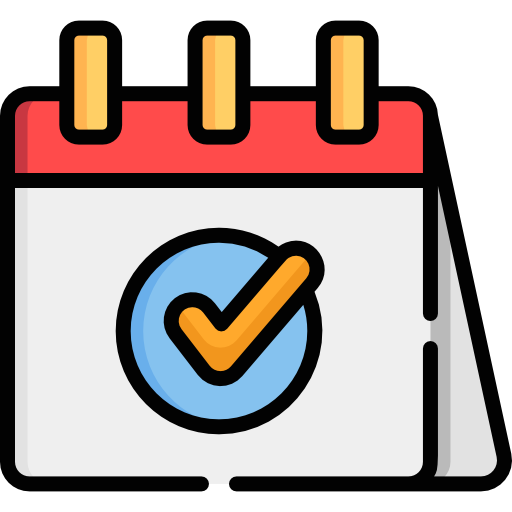

<p align="center">
  
</p>

<h1 align="center">CampusPulse</h1>

<p align="center">
  <strong>Your one-stop destination for campus events, clubs, and student life.</strong>
</p>

<p align="center">
  <a href="#features">Features</a> •
  <a href="#pages">Pages</a> •
  <a href="#tech-stack">Tech Stack</a> •
  <a href="#getting-started">Getting Started</a> •
  <a href="#project-structure">Project Structure</a> •
  <a href="#contributing">Contributing</a>
</p>

---

## 🎯 About

**CampusPulse** is a modern, responsive web platform designed to be the central hub for campus life. It connects students with clubs, events, and communities — making it effortless to discover what's happening on campus, register for events, and find clubs that match your interests.

Built as a fast, lightweight static site with no framework overhead, CampusPulse delivers a polished, app-like experience powered entirely by vanilla HTML, CSS, and JavaScript.

---

## ✨ Features

### 🗓️ Event Discovery & Registration
- Browse a curated feed of upcoming and past campus events
- Filter events by **category** (Technology, Cultural, Sports, Academic, Social) and **status** (Upcoming / Past)
- **Full-text search** across event titles and descriptions
- Detailed event pages with date, time, venue, capacity, and organizing club info
- Live **registration progress bars** showing spots filled vs. capacity
- One-click event registration via an elegant modal form

### 🏛️ Club Directory
- Explore 10+ campus clubs and societies with rich profile cards
- Filter clubs by category and search by name
- Each card shows member count, event count, founding year, and a gradient-branded identity
- CTA to start a new club if your interest isn't represented

### 📊 Admin Dashboard
- At-a-glance stats with **animated counters**: Total Events, Active Clubs, Registrations, Total Members
- Recent events table with registration progress visualization
- Top clubs ranked by membership with bar-chart indicators
- Recent registrations feed showing latest sign-ups
- **Quick Actions** panel: Create Event, Add Club, Generate Report, Send Notification
- **CSV export** of all registration data for offline analysis

### 🎨 Design & UX
- Fully **responsive** — optimized for desktop, tablet, and mobile
- Sticky navigation with mobile hamburger menu
- Indigo-to-violet gradient design system (`#6366f1` → `#8b5cf6`) with amber accent (`#f59e0b`)
- Smooth hover transitions, scale effects, and shadow animations
- Registration modal with enter/exit transitions
- Breadcrumb navigation on detail pages

---

## 📄 Pages

| Page | File | Description |
|------|------|-------------|
| **Home** | `index.html` | Hero section, stats banner, featured events, popular clubs, CTA |
| **Events** | `events.html` | Full event catalog with search, category & status filters |
| **Event Details** | `event-details.html` | Single-event view with full info, organizer, and registration |
| **Clubs** | `clubs.html` | Club directory with search and category filtering |
| **Dashboard** | `dashboard.html` | Admin panel with analytics, tables, and CSV export |

---

## 🛠️ Tech Stack

| Layer | Technology |
|-------|-----------|
| **Structure** | HTML5 (semantic elements) |
| **Styling** | [Tailwind CSS](https://tailwindcss.com/) (CDN) with custom theme config |
| **Logic** | Vanilla JavaScript (ES6+) |
| **Data** | Client-side JSON data store + `localStorage` for registrations |
| **Icons** | Inline SVGs + Emoji |
| **Deployment** | Static files — deploy anywhere (GitHub Pages, Netlify, Vercel, etc.) |

**Zero build step. Zero dependencies. Just open and go.**

---

## 🚀 Getting Started

### Prerequisites

All you need is a modern web browser. No Node.js, no package manager, no build tools.

### Run Locally

1. **Clone the repository**
   ```bash
   git clone https://github.com/ArshilTech/campus-pulse.git
   cd campus-pulse
   ```

2. **Open in your browser**
   
   Simply open `index.html` in any modern browser:
   ```bash
   # macOS
   open index.html

   # Linux
   xdg-open index.html

   # Windows
   start index.html
   ```

   Or use a local dev server for the best experience:
   ```bash
   # Python
   python -m http.server 8000

   # Node.js (if available)
   npx serve .
   ```

3. **Start exploring!**  
   Browse events, check out clubs, and try registering for an event through the modal form.

---

## 📁 Project Structure

```
campus-pulse/
├── index.html              # Home page
├── events.html             # Events listing page
├── event-details.html      # Individual event detail page
├── clubs.html              # Clubs directory page
├── dashboard.html          # Admin dashboard
│
├── js/
│   ├── data.js             # Centralized data store (events, clubs, registrations)
│   ├── home.js             # Home page logic (featured events & clubs)
│   ├── events.js           # Events page (search, filter, render)
│   ├── eventdetails.js     # Event detail page (dynamic content loading)
│   ├── clubs.js            # Clubs page (search, filter, render)
│   ├── dashboard.js        # Dashboard (stats, tables, CSV export)
│   ├── modal.js            # Registration modal (open/close, form handling)
│   └── navbar.js           # Mobile navigation toggle
│
└── assets/
    ├── icon.png            # App icon / favicon
    ├── campus-hero.png     # Hero section background
    ├── tech.png            # Tech Innovators Club image
    ├── cultural.png        # Cultural Society image
    ├── sports.png          # Sports Club image
    ├── photography.png     # Photography Club image
    ├── robotics.png        # Robotics Club image
    ├── environmental.png   # Environmental Club image
    ├── debate.png          # Debate Society image
    ├── entre.png           # Entrepreneurship Cell image
    ├── gaming.png          # Gaming Guild image
    └── music.jpg           # Music Society image
```

---

## 🏗️ Architecture

CampusPulse follows a simple but effective architecture:

```
┌─────────────────────────────────────────────┐
│                  HTML Pages                  │
│  (index, events, clubs, dashboard, details)  │
└──────────────────┬──────────────────────────┘
                   │ references
┌──────────────────▼──────────────────────────┐
│               JavaScript Layer               │
│                                              │
│  data.js ──► Shared data store & helpers     │
│  navbar.js ─► Mobile nav toggle              │
│  modal.js ──► Registration modal logic       │
│  [page].js ─► Page-specific rendering        │
└──────────────────┬──────────────────────────┘
                   │ persists to
┌──────────────────▼──────────────────────────┐
│             localStorage                     │
│  (user registrations saved across sessions)  │
└─────────────────────────────────────────────┘
```

- **`data.js`** acts as the single source of truth — all events, clubs, and sample registrations live here along with shared utility functions (`getClubById`, `formatDate`, `isUpcoming`).
- Each page includes only the scripts it needs, keeping payloads lean.
- Registration data submitted through the modal is stored in `localStorage` and surfaced on the admin dashboard.

---

## 🤝 Contributing

Contributions are welcome! Here's how to get involved:

1. **Fork** the repository
2. **Create** a feature branch (`git checkout -b feature/amazing-feature`)
3. **Commit** your changes (`git commit -m 'Add amazing feature'`)
4. **Push** to the branch (`git push origin feature/amazing-feature`)
5. **Open** a Pull Request

### Ideas for Contributions

- 🔐 User authentication (Firebase Auth, Supabase, etc.)
- 🗄️ Backend integration with a real database
- 📱 Progressive Web App (PWA) support
- 🌙 Dark mode toggle
- 📧 Email notifications for event reminders
- 🗺️ Campus map integration for venues
- 📈 Advanced analytics with charts (Chart.js / D3.js)

---

## 👥 Team

Built with ❤️ by **Team CODEVATIVE** during **CodeSprint**

| Name | Role |
|------|------|
| **Arshil Masood** | Developer |
| **Abdullah Ansari** | Developer |

---

## 📝 License

This project is open source and available under the [MIT License](LICENSE).

---

<p align="center">
  <sub>Built for CodeSprint 🏆</sub>
</p>